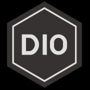

  

# Diogo.css – v0.2
* 更新时间 20161027 [issues list](https://github.com/a233894432/MyCodeLibrary/issues)
- A minimalist CSS framework.
- 一个极简的CSS框架
- Browser support covers IE9+ as well as all other modern browsers.
- 支持IE9以上 ,或其他  modern browsers.
- new ui-module , alert module
- 新加常用UI组件, 弹窗组件 js
- 需要jquery 2.0 的支持(\* 有些JS组件)

## Browser Support

### iOS
- [x] Last 5 iOS versions

### Android
- [x] Last 5 Android versions
- [x] Last 5 ChromeAndroid versions
- [x] Last 5 UCAndroid versions (\*)
- [x] Last 5 FirefoxAndroid versions (\*)
- [x] Last 5 OperaMobile versions (\*)
- [x] Last 5 OperaMini versions (\*)
- [x] Last 5 Samsung versions (\*)

### Others
- [x] Last 3 Chrome versions
- [x] Last 3 Firefox versions
- [x] Last 3 Safari versions
- [x] Last 3 Edge versions
- [x] Last 5 ExplorerMobile versions (\*)

### 更新日志
#### 2017年2月24日16:09:57
  - 修复 container - outline